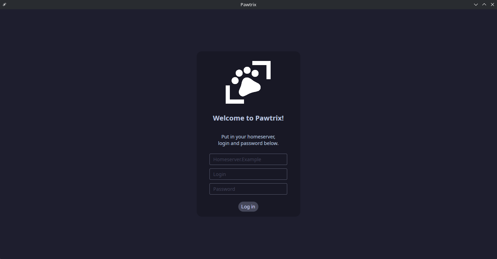
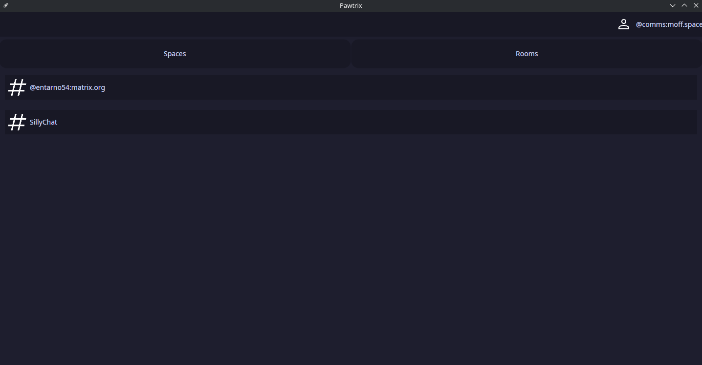
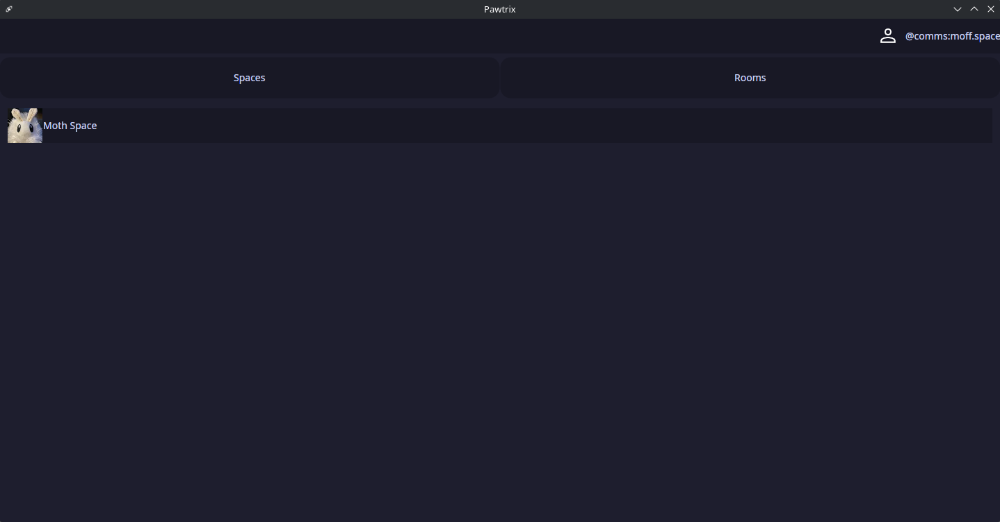
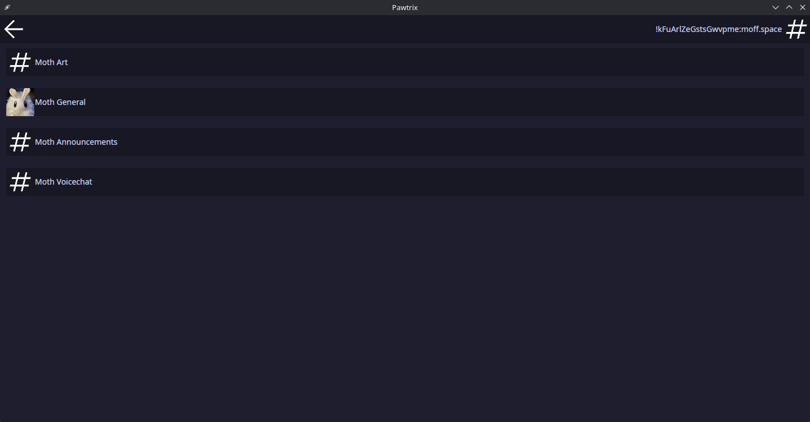
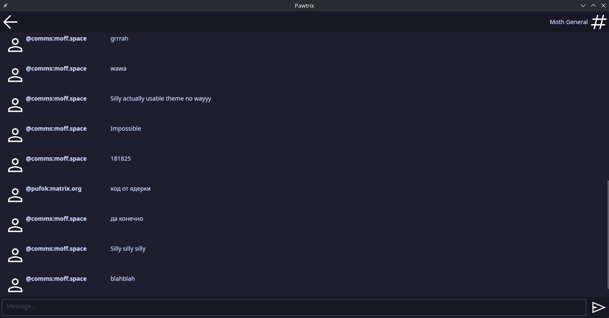

# Pawtrix </img>

Pawtrix is a [matrix] client made in C# using the [Avalonia framework](https://avaloniaui.net/)

## Downsides:
- Pretty much unusable as of right now due to only being able to have limited chats in rooms you already joined.
- Ugly but not too much UI

## Current features
As of this point in time when i'm writing this README, Pawtrix supports:
- Logging in, to log out you need to press the profile icon in the room list. (You have to register an account before using pawtrix)
- Your already joined chats
- 30 messages of chat history

## What's planned?
- Joining public rooms (the room / space public lists)
- Opening people's profiles
- DMing people (creating private rooms)
- E2EE (it's not supported yet)
- Emojis, Stickers


### Building
To build Pawtrix you need to have [.Net](https://dotnet.microsoft.com/en-us/download) installed on your system.

For Windows users it's just a simple exe click, linux users can find it in their repositories usually named dotnet8.0

```
git clone https://github.com/Entarno54/Pawtrix
cd Pawtrix
dotnet restore
dotnet build --configuration Release --no-restore
cd Pawtrix/bin/Release/net8.0
```

## Previews:




